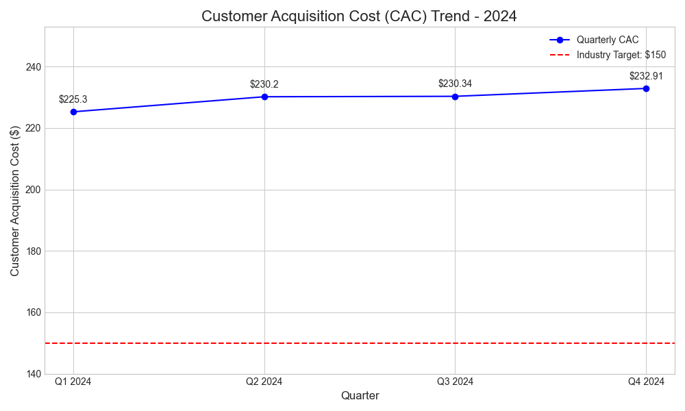

# Financial Services Performance Analysis: A Data Story

**Author:** Senior Data Analyst  
**Email:** 24f1000537@ds.study.iitm.ac.in  
**Date:** August 20, 2025  

---

## 1. Executive Summary
This report provides a comprehensive analysis of the company's Customer Acquisition Cost (CAC) for the 2024 fiscal year. The analysis reveals a concerning upward trend in CAC, significantly exceeding the industry benchmark. This data story will delve into the key findings, business implications, and actionable recommendations to optimize our digital marketing channels and steer our CAC towards the target of $150.

---

## 2. Key Findings
The quarterly data for 2024 shows a steady increase in our Customer Acquisition Cost:

- **Q1:** $225.3  
- **Q2:** $230.2  
- **Q3:** $230.34  
- **Q4:** $232.91  

The average CAC for the year stands at **$229.26**, which is **53% higher** than the industry target of $150. This trend indicates that our marketing efforts are becoming less efficient over time.

### Data Visualization
The following chart visualizes the quarterly CAC trend against the industry benchmark:

---

## 3. Business Implications
- **Reduced Profitability:** Higher acquisition costs directly impact our profit margins.  
- **Decreased Marketing ROI:** Rising CAC signals diminishing returns on marketing spend.  
- **Competitive Disadvantage:** Competitors with lower CAC can outspend us in other areas.  
- **Unsustainable Growth:** Rising CAC threatens long-term scalability.  

---

## 4. Recommendations: Optimize Digital Marketing Channels
To address the rising CAC and achieve our target of $150:

### a. Conduct a Channel-Specific Performance Audit
- Break down CAC by channel.  
- Identify underperforming/high-cost channels.  
- Reallocate budget to high-ROI channels.  

### b. Enhance Targeting and Personalization
- Refine segmentation.  
- Personalize ad messaging.  
- Implement retargeting campaigns.  

### c. Improve Conversion Rate Optimization (CRO)
- A/B test landing pages and ads.  
- Streamline user journey.  

### d. Invest in High-Intent Channels
- Strengthen SEO.  
- Use long-tail keywords.  

---

## 5. Conclusion
The rising Customer Acquisition Cost is a critical issue that requires immediate attention. By optimizing digital marketing channels, we can improve efficiency and reduce CAC to the industry target of $150. This data-driven approach will enhance profitability and ensure sustainable growth.
